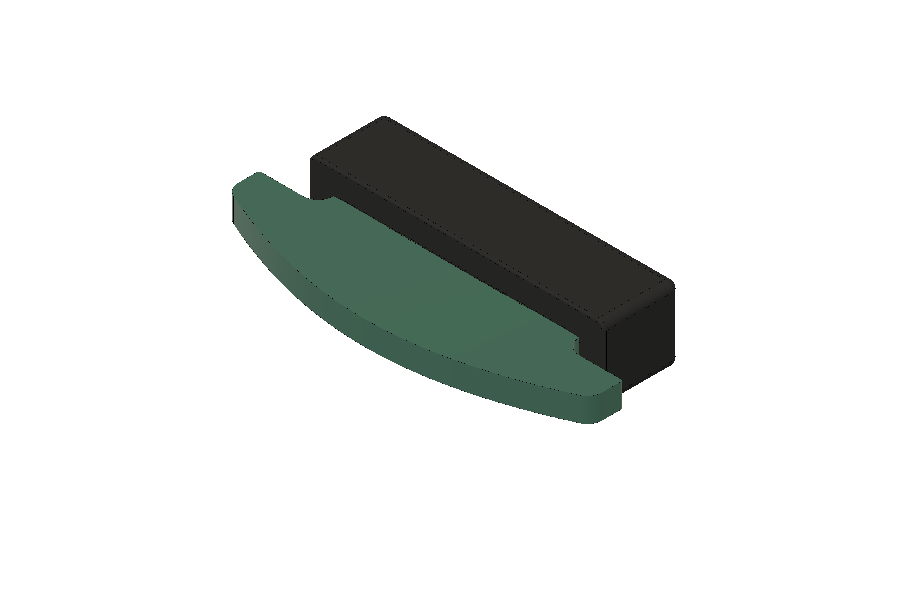
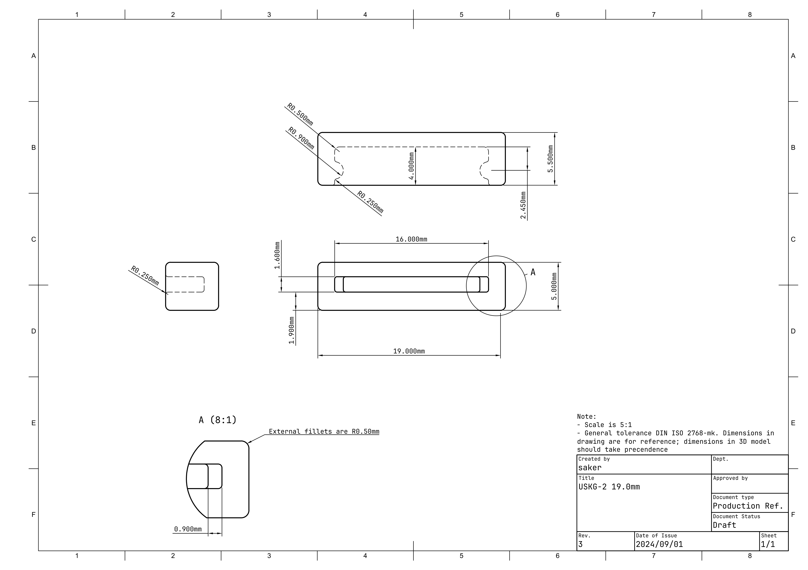

## Universal Silicone Keyboard Gasket

### Preface
The initial Universal Silicone Keyboard Gasket was a keyboard gasket sock that was originally used in the Mira keyboard designed by Saker. Primary goal to design it to be easily implemented in future designs with and be used by others openly without many restrictions. 

With USKG-2, the design was changed to be easier to use in other designs and be easier to use securely by builders.

### Use this gasket with you own keyboard
The files for the gasket are located in the [production](./production/) directory.

The ideal mounting tabs and implementation for USKG should be **16.20(w) x 1.50mm(h)**. The mounting tab **depth needs to be at least 3.50mm** for the plate sock to be seated completely. USKG has a internal piece to clip onto the mounting tab. A slot should be made 2.00mm away from the end of the mounting tab. Check the example implementation in [examples](./examples/) directory.

The minimum area around the plate socks (bounding box) should be at least 20.00(w) x 4.90(h) x 5.00mm(d). Using these exact numbers for the mounting location cutouts will result in a very tight fit. If you would like the gasket to aid as a force break between the top and bottom case, consider reducing the height of the cutout to below 4.90mm.

### Roadmap
* [X] Finalize naming to be easier to reference
    - Current naming is bit long and very specific to personal Mira keyboard project, not ideal for universal use
* [X] Finalize technical drawings for reference for manufactures and implementation for designers
    - Many improvement and callouts can be made in technical drawings
    - Title block needs to be updated to include general tolerance information instead of it being a separate note
* [ ] Add reference images of prototypes/production in readme
* [ ] Utilise releases for USKG versions and alternate models
* [ ] Manufacturer details that have the production molds
* [ ] License?
* [ ] Update production files to version 2 of USKG
    - move version 1 files to separate location

#### Contributing
This project is meant to be a resource and benefit for the community. It is open to contributions to any who are willing to suggest improvements, changes, or corrections.