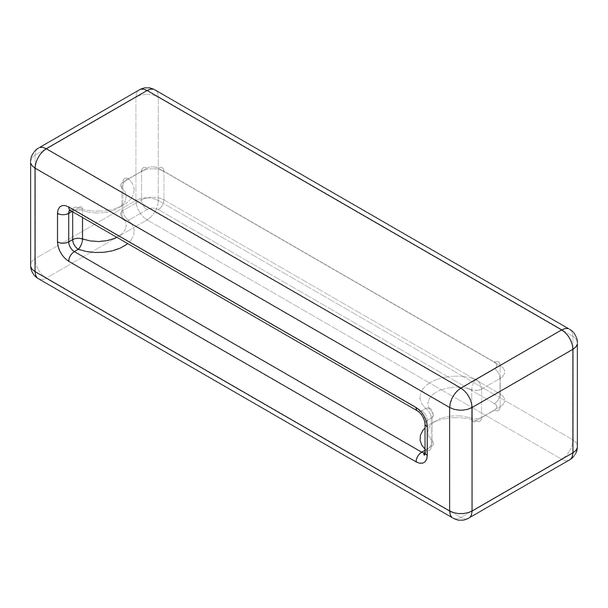

## Universal Silicone Keyboard Gasket

### Preface
The initial commit of the Universal Silicone Keyboard Gasket was a keyboard gasket sock that was originally used in the Mira keyboard designed by Saker. With the primary goal to design something easily implemented in future keyboard designs and be used by others openly without many restrictions. 

With USKG-2, the design was changed to be easier to use in other designs and be easier to by individuals building keyboards with it.

### Use USKG with your own keyboard
The files for the gasket are located in the [production](./production/) directory.

The ideal mounting tabs and implementation for USKG-2 should be **16.00(w) x 1.50mm(h)**. Mounting tab height of 1.60mm (standard PCB) will work as well. The mounting tab **depth needs to be at least 4.00mm** for the plate sock to be seated completely. USKG-2 has internal bumps to slot onto the mounting tab. Slots on the side of the mounting tabs should have a radius of 1.00mm and 2.45mm from the edge. Reference the example implementation in [examples](./examples/) directory.

The minimum area around the plate socks (bounding box) should be at least 20.00(w) x 4.90(h) x 5.50mm(d). Using these exact numbers for the mounting location cutouts will result in a very tight fit. If you would like the gasket to aid as a force break between the top and bottom case, consider reducing the height of the cutout to below 4.90mm.

### Roadmap
* [X] Finalize naming to be easier to reference
    - Current naming is bit long and very specific to personal Mira keyboard project, not ideal for universal use
* [X] Finalize technical drawings for reference for manufactures and implementation for designers
    - Many improvement and callouts can be made in technical drawings
    - Title block needs to be updated to include general tolerance information instead of it being a separate note
* [ ] Add reference images of prototypes/production in readme
* [ ] Manufacturer details that have the production molds
* [ ] License?
* [X] Update production files to version 2 of USKG

#### Contributing
This project is meant to be a resource and benefit for the community. It is open to contributions to any who are willing to suggest improvements, changes, or corrections.