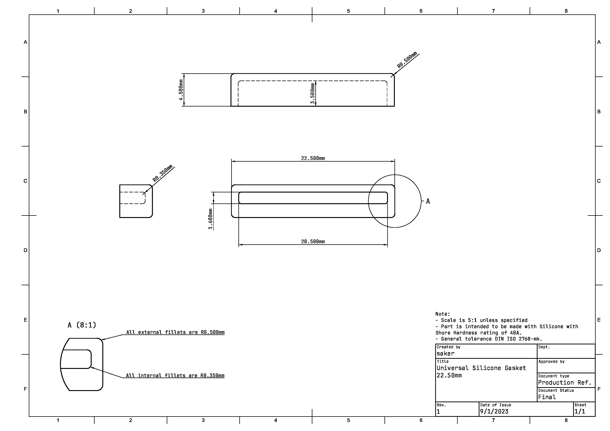

## Universal Silicone Gasket

### Preface
The initial Universal Silicone Gasket (naming is WIP) is the standard gasket that is used for the Mira keyboard designed by Saker. It was designed to be easily implemented in future designs and be used by others openly without restrictions. 

### Use this gasket with you own keyboard
The reference files for the gasket are located in the [production](./production/) directory. You may also look at the releases section.

The ideal mounting tabs and implementation for USG should be **20.00(w) x 1.50mm(h)**. The mounting tab **depth needs to be at least 3.50mm** for the plate sock to be seated completely. 

The minimum area around the plate socks (bounding box) should be at least 22.50(w) x 4.50(h) x 4.50mm(d). Using these exact numbers for the mounting location cutouts will result in a very tight fit.

### Roadmap
* [X] Finalize naming to be easier to reference
    - Current naming is bit long and very specific to personal Mira keyboard project, not ideal for universal use
* [X] Finalize technical drawings for reference for manufactures and implementation for designers
    - Many improvement and callouts can be made in technical drawings
    - Title block needs to be updated to include general tolerance information instead of it being a separate note
* [ ] Add reference images of prototypes/production in readme
* [ ] Utilise releases for USG versions and alternate models
* [ ] Manufacturer details/contact

#### Contributing
This project is meant to be a resource and benefit for the community. It is open to contributions to any who are willing to suggest improvements, changes, or corrections.